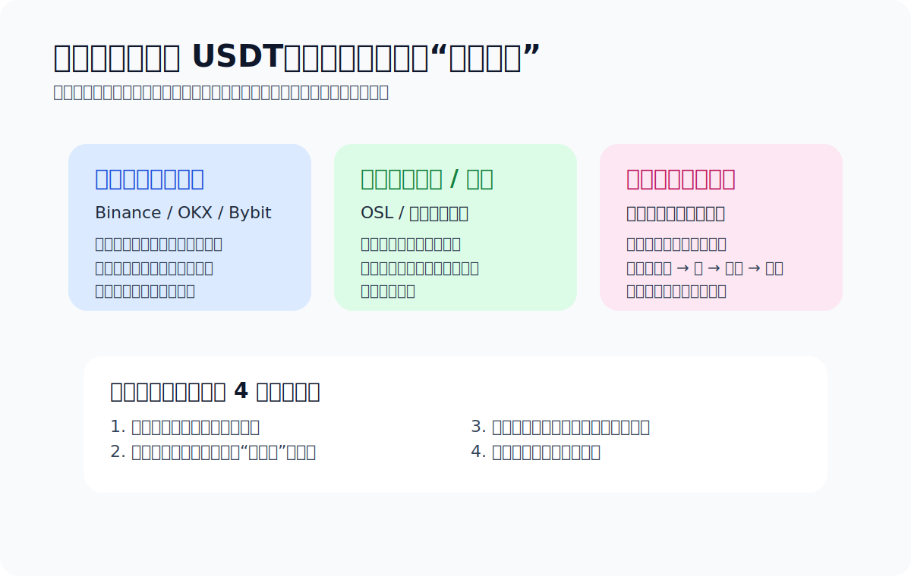

# 人在中国怎么买 USDT / BTC

> Practical Notes · 面向中国大陆用户 · Last updated: 2026-04-14

这页不是“教程神话”，而是现实说明。对中国大陆用户来说，真正要面对的问题通常不是“有没有地方可以买”，而是：**哪种路径在现实里更常见、每种路径各自风险是什么、为什么很多老用户真正怕的是支付侧，而不是买币按钮本身。**

> TL;DR：现实里，大陆用户接触加密资产，常见会先接触 Binance、OKX、Bybit 这类综合平台里的买币入口或 C2C 区；如果你是香港身份、香港账户或更重视持牌合规路径，OSL 这类平台会更有讨论价值。关键不是“谁能买”，而是“你的支付条件、地区身份、风险承受能力，更适合哪条路径”。

## 先把常见平台放回正确位置

| 平台 | 现实里更像什么 | 中国用户会怎么看它 | 重点注意 |
| --- | --- | --- | --- |
| Binance | 综合型交易平台 + C2C 入口 | 很多人第一反应会想到它，因为路径全、流动性强、讨论也多 | 中国大陆用户更要关注支付风控、账户路径和规则变化 |
| OKX | 综合型交易平台 + 买币入口 | 中文语境下讨论度高，新手更容易找到图文和视频教程 | 能不能用、能用到什么程度，要看地区和实际支付条件 |
| Bybit | 综合平台，买币路径相对直接 | 适合想先跑通一笔、但不想一上来研究太多复杂功能的人 | 同样要自己处理地区、支付、后续用途的问题 |
| OSL | 更偏持牌 / 合规平台路径 | 更适合香港或更关注持牌平台身份的人讨论 | 不是所有大陆用户都能顺手走这条路径，取决于身份、账户和地区条件 |

## 现实中更常见的用户分层

### 1. 大陆新手，第一次只是想买一点试试
这类用户最容易接触到的是综合平台里的买币入口或 C2C 讨论。问题不在“找不到入口”，而在：买完后不知道怎么提、不知道链怎么选、不知道为什么还会有支付和风控问题。

### 2. 已经有一定经验，开始看 C2C / OTC
这类用户嘴上问价格，心里真正怕的是：账户风控、问题资金、解释成本、对手方质量。老用户之间的“别碰太猛”通常不是保守，是见过后果。

### 3. 有香港身份 / 香港银行卡 / 更关心持牌路径的人
这类用户看 OSL、HashKey 这类路径会更有现实意义。不是因为它们一定更便宜，而是因为合规身份和账户条件更匹配。

## 为什么大家真正担心的常常不是“买不到”

- **支付侧风控**：现实里比链上失败更常见。
- **问题资金**：很多人真正怕的是钱的来路和后续麻烦。
- **错误网络**：买到了 USDT，后面不会发，照样没用。
- **第一次就上强度**：一上来就大额、套利、搬砖，风险指数上升最快。

## 如果你是中国大陆新手，我的建议顺序

1. 先别急着比较 Binance、OKX、Bybit 谁“更强”，先看你自己能否理解它的路径。
2. 先小额跑通一条你看得懂的路径。
3. 买完以后立刻补钱包、转账、网络这些基本功。
4. 如果你后面主要走 TRC20，再补 TRX / 能量那条线。

## 用户常问：现在想安安稳稳搞点币，怎么就这么难

如果你最近在搜的是“现在怎么搞虚拟货币”“普通人怎么买 U”“空投怎么没以前好赚了”“挖矿是不是太慢了”“C2C 会不会冻卡”“对面万一是黑钱怎么办”，那你的体感基本没错。

这两年对普通人来说，低摩擦、低风险、低门槛的入口确实变少了。空投越来越卷，挖矿越来越像资源和周期游戏，C2C 又把现实里的支付风控、问题资金、解释成本全都摆到了台面上。所以很多人真正卡住的，不是“不会点买入”，而是找不到一条自己能理解、也敢承担后果的路径。

如果你问我有没有相对稳妥、又不那么折腾的方案，我会把答案收得很窄：

- 不把空投当成稳定收入来源。现在更像高投入、低确定性的副线，不适合拿来解决“我想先搞到第一笔 U”。
- 不把挖矿当成短期赚快钱工具。除非你已经有设备、资源和周期预期，否则它对新手往往既慢又分心。
- 如果你只是想先持有一点 USDT / BTC，优先选自己看得懂规则的平台路径，小额、分次、只做买入，不急着高频折腾。
- 先解决“买完放哪、怎么提、怎么发”这三个问题，再去想点差、效率和所谓机会。
- 凡是让你离开平台托管、私下转账、代买代付、站外担保、熟人带路的方案，默认都比它看起来更危险。

对大多数普通人来说，所谓“不那么折腾”的现实答案通常不是找到一条神奇捷径，而是接受这本来就是高风险领域，然后用最笨但最清楚的方式入场：小额买入，先跑通一次提币到自托管钱包，再学会确认网络和第一次转账。等你能把这几个动作稳定做对，再去决定要不要继续往里走。

## 用户常问：如果想认真学数字货币和投资，应该从哪里开始

很多新手一上来就想找“大神频道”“内幕群”“百倍币社区”，但更稳的顺序通常相反：**先学框架，再看社区；先分清投资和投机，再决定自己到底在学什么。**

如果借用“大宇”那类内容的核心提醒，我觉得第一步不是找答案，而是先把这几个问题分开：

- 你是在学 **资产认知**，还是在学 **短线交易**。
- 你是想理解 **比特币 / 以太坊 / USDT 各自扮演什么角色**，还是只想找下一次涨跌。
- 你能不能先接受 **收益和风险永远绑定**，而不是一边想低风险，一边追高波动和高杠杆。

对大多数普通人来说，更适合的学习顺序通常是：

1. 先学概念：什么是 BTC、ETH、USDT，什么是现货、合约、钱包、自托管、链和网络。
2. 再学操作：怎么买一小笔、怎么提到钱包、怎么确认地址和网络、怎么做第一次小额转账。
3. 再学风险：仓位管理、止损、资金来源风险、支付风控、平台规则变化、链上不可撤回。
4. 最后才碰策略：你到底是长期持有、定投观察，还是承认自己做的是高波动投机。

如果这四步顺序反过来，最常见的结果就是：概念没懂，动作半懂，先被“机会”牵着走。

## 有没有虚拟货币学习讨论的社区或频道

有，但我更建议你把“社区”分成两类看：**一类是帮你长知识的，一类是放大情绪的。** 真正适合新手长期看的，往往是前者。

### 更值得优先看的地方

- **官方文档 / 帮助中心**：钱包、交易平台、区块链浏览器的官方说明，通常最适合补基础动作。比如提币规则、网络说明、手续费、风控提示，这些比群消息更重要。
- **公开可回看的长文社区**：比起临时群聊，我更推荐能沉淀文章、教程、问答的地方。中文里可以留意登链这类偏技术和原理向社区；英文里可以看 Bitcoin StackExchange、Ethereum StackExchange 这类问题导向社区。
- **开放论坛 / 大社区**：如果你想看不同立场的人怎么讨论，Bitcointalk、Reddit 上的 `r/BitcoinBeginners`、`r/ethereum` 这类公开社区，比“拉你进群”的私域环境更容易交叉验证。
- **研究型内容源**：长文、播客、Newsletter、项目研究，比“今日必涨”更值得长期看。重点不是跟单，而是看对方怎么论证、怎么承认不确定性、怎么谈风险。

### 新手不太适合当主学习来源的地方

- **交易所广场和喊单区**：它们更像情绪场，不像课堂。
- **私密收费群 / 带单频道**：你很难知道对方靠什么赚钱，也很难验证历史成绩。
- **只贴盈亏截图、不讲逻辑的账号**：看起来最刺激，实际最难复盘。
- **把空投、挖矿、套利包装成“低风险副业”的内容**：这类东西最容易让新手误把投机当投资。

### 怎么判断一个社区值不值得长期看

- 它是不是鼓励你回到原始资料，而不是只相信群主。
- 它讨论的是逻辑、规则、仓位和风险，还是只讨论“今天买哪个”。
- 它能不能接受不同观点，还是只要质疑就被说成“没格局”。
- 它有没有公开沉淀，而不是消息一刷就没、事后无法复盘。

如果你问我最朴素的建议，我会说：**先用 80% 的时间补基础，20% 的时间看社区；而不是反过来。** 社区最好的用途是帮你发现问题，不是替你做决定。

## 我会让你顺手看的官方参考

- [imToken TRX 钱包支持专题](https://support.token.im/hc/zh-cn/sections/360006457153-TRX-%E9%92%B1%E5%8C%85)
- [imToken：如何获得带宽与能量](https://support.token.im/hc/zh-cn/articles/360037636294-%E5%A6%82%E4%BD%95%E8%8E%B7%E5%BE%97%E5%B8%A6%E5%AE%BD%E4%B8%8E%E8%83%BD%E9%87%8F)

这些资料不能替你做决策，但它们能帮你把“买完以后怎么安全接到自己的钱包里”这条线补得更扎实。

> 风险提醒：这页不是法律意见，也不是规避指南。中国大陆用户接触加密资产，现实中的关键风险包括：监管不确定性、支付工具风控、银行卡或账户冻结、交易对手风险、问题资金风险，以及链上不可撤回风险。请自行判断风险承受能力，并确认当地法律、平台规则和服务条款。

## 上一篇 / 下一篇

- 上一篇：[如何购买 Tether USDt（USDT）](./how-to-buy-usdt.md)
- 下一篇：[怎么选钱包](./how-to-choose-a-wallet.md)
