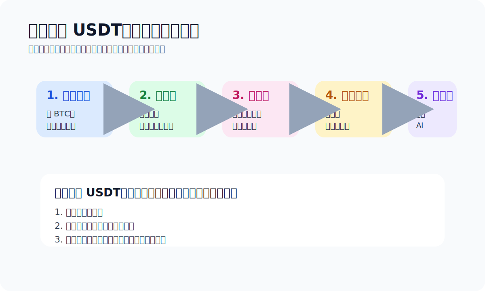

# 如何购买 Tether USDt（USDT）

> Chapter 1 · Buy USDT · Last updated: 2026-04-14

搜“如何买 USDT”的时候，你想知道的其实不是定义，是**用哪个平台、哪种方式对得上自己、第一次怎么操作不出事。**

> TL;DR：Binance / OKX / Bybit 是综合型平台，里面一般同时有 C2C 和买币入口；OSL 偏持牌合规路径；MetaMask 是钱包内的买币聚合入口，不适合新手当主入口。第一次操作，选一条你看得懂、身份和支付都准备得了、能先小额跑通的路径。

## 第一次买 USDT，最该看的不是价格

我看新手买 U，从来不是先看谁便宜几块钱，而是这三件事：

1. 路径看不看得懂
2. 买完能不能安全提到自己钱包
3. 中间出问题时知道该停在哪一步

## 买之前先做好这几件事

### 1. 先选入口，不是先选最低价
新手最容易上来就问“哪家最便宜”。更有用的问题是：哪家你看得懂、路径稳定、对得上你所在地区和支付条件。

### 2. 把账户和身份准备好
Binance、OKX、Bybit、OSL 这类平台都要注册账户，KYC 力度不一样。

### 3. 想好支付方式和买完要去哪
买 USDT 不是终点。买完之后要放平台、提到钱包、还是直接拿去付款，这几种去向你最好提前想好。

## 具体平台，分别像什么

| 平台 / 工具 | 更像什么 | 适合谁 | 我会提醒的新手注意点 |
| --- | --- | --- | --- |
| Binance | 综合型交易平台 + C2C 入口 | 想同时接触买币、交易、后续转账的人 | 中国大陆用户要重点关注支付风控、账户路径和规则变化 |
| OKX | 综合型交易平台 + 买币入口 | 希望用中文界面快速理解买币流程的人 | 不同地区可用功能和支付方式会有差异 |
| Bybit | 综合型平台，买币路径相对清晰 | 想快速完成第一笔基础购买的人 | 仍然要自己判断支付方式、地区规则与后续用途 |
| OSL | 更偏持牌 / 合规入口 | 更看重合规身份和持牌平台路径的人 | 通常更依赖地区身份、支付与账户条件 |
| MetaMask | 钱包内买币聚合器 | 已经在用钱包、想直接在钱包里完成买法的人 | 更像补充入口，不是我最建议新手拿来当第一站的地方 |

## 怎么买：C2C vs 平台直购

### C2C 交易
- 适合：愿意花点时间挑商家、比较支付方式的人。
- 好处：支付方式灵活，更接近真实用户的买法。
- 麻烦：要自己盯商家信誉、支付风控和摩擦成本。

### 平台直购
- 适合：想快速完成第一笔、少做判断的人。
- 好处：步骤少，接近传统买入体验。
- 麻烦：支付方式、报价、费用不一定最优。

## C2C 实战：一个完整的安全购买流程

1. 在平台买币入口选 USDT。
2. 进 C2C 区。
3. 筛商家：先看完成率、历史成交量、认证信息，别只盯最低价。
4. 下单锁价。
5. 按规则付款，别私下改规则。
6. 付完点“我已付款”。
7. 等商家放币，到账之后再决定提币还是转钱包。

> 一个现实细节：很多人付款备注会刻意避开“USDT”“数字货币”这种词。不是故弄玄虚，是支付风控和摩擦成本的现实。

## 买完之后，下一步通常是什么

- 要不要提到自己的钱包？
- TRC20 和 ERC20 怎么选？
- 为什么转 TRC20 还要提 TRX？

> 买完之后的默认下一步：如果你准备自己管理 TRON / USDT，不打算一直放在平台，我通常会先把你引到 [imToken](https://token.im/trx-wallet)。不是说它是唯一答案，它走过 10 年、社区验证过，作为“买完之后真正开始用”的起点合适：先建自托管钱包、备份助记词、收到第一笔 USDT、跑通第一次转账。

## 最常见的错误和骗局

- 私下交易诱导：有人会用更低价把你从平台托管里拉走。
- 只看最低价：忽略商家历史和支付风险。
- 只看 USDT，不看链：提币或转账时一定出事。
- 第一次就大额：流程没走通，错误成本直接放大。
- 买完不会提、不会发、不会确认网络：多数新手就卡在这里。

## 官方参考入口

- [Tether Transparency](https://tether.to/en/transparency/)：看 USDT 官方透明度与储备说明。
- [Binance Buy Crypto](https://www.binance.com/en/buy-sell-crypto)：综合买币入口。
- [OKX Buy Crypto](https://www.okx.com/buy-crypto)：快速买币入口。
- [Bybit Buy Crypto](https://www.bybit.com/en/buy-crypto/)：法币买币入口。
- [OSL](https://osl.com/)：持牌 / 合规路径说明。
- [官方资料入口](./official-sources.md)：如果你想把买币、钱包、TRON 资料一次性看完，直接从这里进。

> 风险提醒：本文不是投资建议，也不是法律意见。对大陆用户，现实里的几个关键风险是：支付风控、账户冻结、问题资金、交易对手、错误网络、转账不可撤回。

## 上一篇 / 下一篇

- 上一篇：[USDT 是什么](./what-is-usdt.md)
- 下一篇：[人在中国怎么买 USDT / BTC](./china-buy-crypto-notes.md)
- 延伸：[官方资料入口](./official-sources.md)
