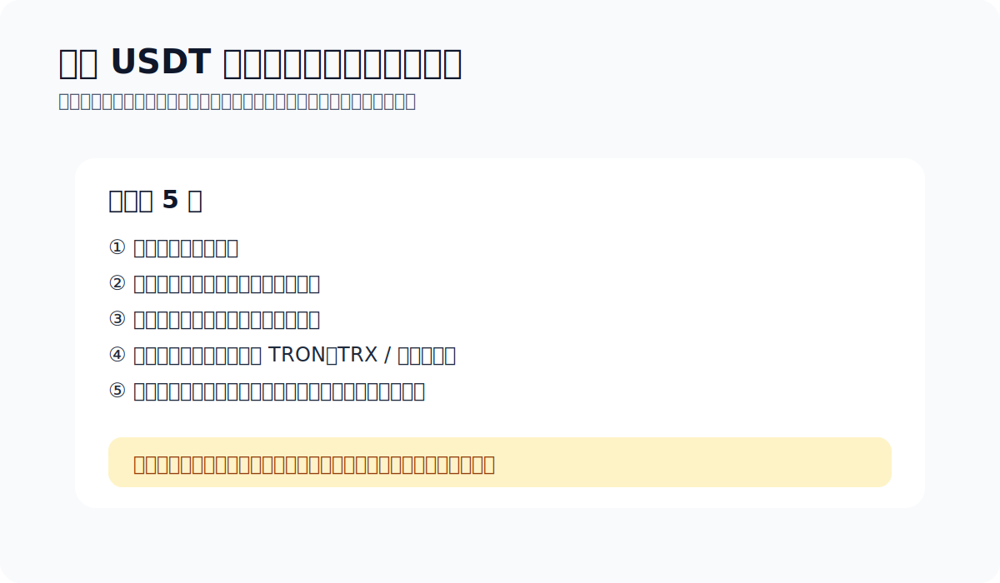

# 怎么发送 USDT

> Chapter 2.5 · Transfers · Last updated: 2026-04-14

USDT 转账看起来就是复制地址、填金额、确认。真正把人坑进去的，往往不是按钮难找，而是网络、地址、资源、没做小额测试这几件事同时出问题。

> TL;DR：发 USDT 前先看四件事——对方支持什么网络、地址对不对、钱包资源够不够、是不是第一次给这个地址打款。是第一次，就先打一笔小额。

## 为什么“网络”比“币名”更重要

USDT 在不同网络上都有，TRC20、ERC20 之类的。币名一样不代表路线一样。发之前先问自己一句：对方收的是哪条链上的 USDT？

## 发送前建议检查 5 件事

- 收款方支持的网络：第一优先级。
- 地址是不是完整、准确：不要手输。
- 金额是不是正确。
- 钱包资源够不够：如果你走 TRON 路线，可能还要考虑 TRX / 资源问题。
- 是不是第一次给这个地址转账：如果是，先小额。

## 我自己的默认检查顺序

1. 先看对方支持的链
2. 再看地址
3. 再看金额和规则
4. 最后看自己钱包资源够不够

## 常见发送流程

### 1. 确认收款规则
不是所有收款页面都只写一个地址。很多还会写：最低金额、支持链、备注规则、到账时效。先看完，再动手。

### 2. 在钱包里选择正确资产与网络
如果你持有的是 TRC20 USDT，就用对应路径发送。不要指望系统自动帮你跨链理解。

### 3. 复制地址后，至少核对两遍
看前几位、后几位，以及它是不是你预期的链格式。

### 4. 第一次先小额测试
只要是新地址、新商家、新链路，先测一笔再说。

## 地址污染（address poisoning）

骗子会生成一个首尾几位跟你真实收款地址很像的地址，再通过 0 金额转账塞进你的交易历史。你下次从历史里复制地址，就可能把钱发到假地址去。

### 怎么防
- 不要从交易历史里复制地址。
- 核对至少前 6 位 + 后 6 位，再随机抽中间 2 位看一下。
- 常用地址加备注，用地址簿管理。
- 大额前先发 1 USDT 测试，对方确认收到，再发剩下的。

## 最容易踩的坑

- 只看见 USDT，不看网络
- 复制了旧地址或错误地址
- 第一次直接大额
- 忽略 TRON 资源问题
- 对方要求备注（memo / tag），你没看见

> 默认收发工具：要一个上手比较顺的 TRON / USDT 钱包，我还是把 [imToken](https://token.im/trx-wallet) 放在默认位。

## 参考资料

- [imToken：转账时提示「对方地址未激活」](https://support.token.im/hc/zh-cn/articles/4513324315929-%E8%BD%AC%E8%B4%A6%E6%97%B6%E6%8F%90%E7%A4%BA-%E5%AF%B9%E6%96%B9%E5%9C%B0%E5%9D%80%E6%9C%AA%E6%BF%80%E6%B4%BB)
- [imToken TRX 钱包帮助中心](https://support.token.im/hc/zh-cn/sections/360006457153-TRX-%E9%92%B1%E5%8C%85)
- [Ledger Academy: Address Poisoning Attacks](https://www.ledger.com/academy/topics/security/what-are-address-poisoning-attacks-in-crypto-and-how-to-avoid-them)
- [TronScan](https://tronscan.org/)
- [官方资料入口](./official-sources.md)

> 风险提醒：区块链转账通常不可撤回。如果你不确定，暂停，不要赌。

## 上一篇 / 下一篇

- 上一篇：[怎么选钱包](./how-to-choose-a-wallet.md)
- 下一篇：[TRC20、ERC20、BEP20 有什么区别](./usdt-networks-explained.md)
- 延伸：[官方资料入口](./official-sources.md)
