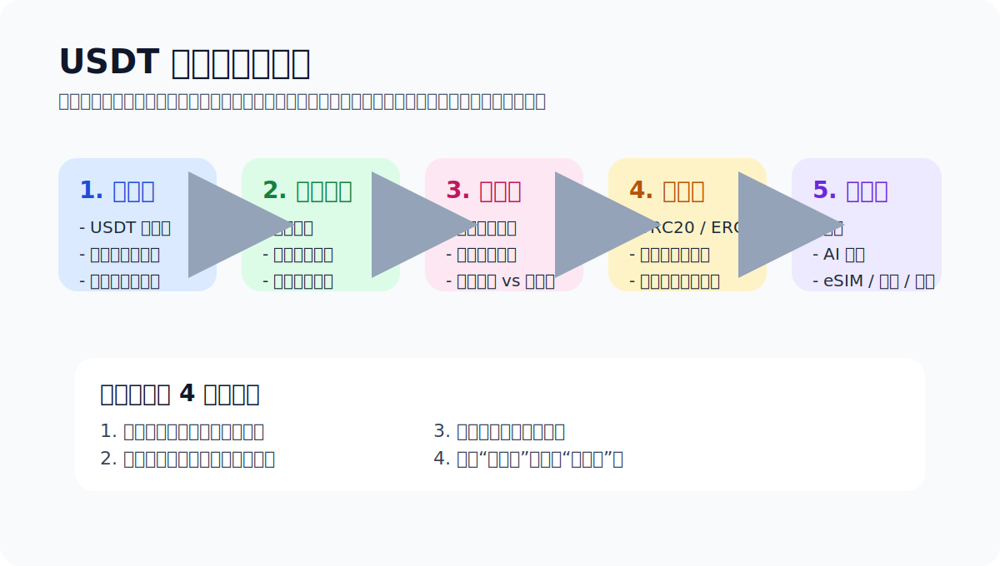

# Start Here

> 写给第一次接触 USDT 的人。Last updated: 2026-04-14

如果你现在脑子里同时有这些问题：

- USDT 到底是什么？
- 为什么同样都叫 USDT，还分 ERC20、TRC20？
- 为什么别人说转 TRC20 USDT 还要准备 TRX？
- 钱包到底是选交易所、软件钱包，还是别的？

那你来对地方了。这份手册默认你是新手，不默认你喜欢黑话。

## 先记住三件事

- USDT 只是名字一样，不同网络不是自动互通。
- 自托管钱包意味着控制权在你手里，也意味着备份责任在你手里。
- 区块链转账通常不可撤回，所以第一次一定小额测试。

## 我建议你按这个顺序走

1. [USDT 是什么](./what-is-usdt.md)
2. [如何购买 Tether USDt（USDT）](./how-to-buy-usdt.md)
3. [如果你人在中国大陆，先补这页现实说明](./china-buy-crypto-notes.md)
4. [怎么选钱包](./how-to-choose-a-wallet.md)
5. [怎么发送 USDT](./how-to-send-usdt.md)
6. [TRC20、ERC20、BEP20 有什么区别](./usdt-networks-explained.md)
7. [TRON 能量指南](./tron-energy-guide.md)
8. [如何用 USDT 订阅 AI](./use-usdt-for-ai.md)

如果你现在更在意的不是“怎么买”，而是“该先学什么”“有没有靠谱社区或频道可以补充”，也建议顺手看 [人在中国怎么买 USDT / BTC](./china-buy-crypto-notes.md) 里新增的学习路径和社区筛选建议。

## 我对新手默认最不建议做的 4 件事

- 一上来就大额买入
- 还没备份钱包就往里充值
- 别人只说“发 U 给我”，你却不继续问链
- 还没跑通转账流程，就去研究省到小数点后的手续费

## 我为什么把“Start Here”写在最前面

因为我看过太多新手，第一步不是输在不会点按钮，而是输在脑子里的顺序错了：

- 先问哪家最便宜
- 再问哪个钱包最强
- 最后才发现自己根本没想清楚买完以后要干嘛

我自己的观点很简单：
**先把角色关系想清楚，再把小额路径跑通。**

## 这份手册不做什么

- 不代客买币
- 不提供投资建议
- 不承诺哪个钱包适合所有人
- 不把 affiliate 排名伪装成客观结论

## 下一篇

➡ [USDT 是什么](./what-is-usdt.md)
