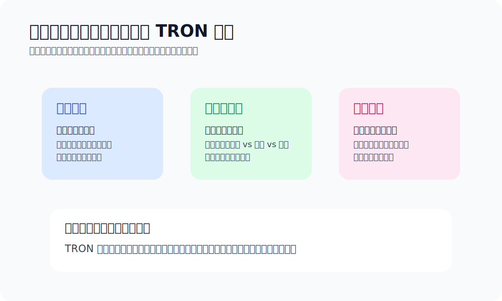

# TRON 能量指南

> Chapter 3 · TRON / TRC20

这篇解决一个常见问题：**为什么你明明有 TRC20 USDT，转账时却还是可能失败，或者手续费比预期高出一截。**

> TL;DR：在 TRON 上发送 USDT，不只是“有币就行”，还要考虑网络资源。链上动作需要消耗资源，资源不足时要么成本变高，要么直接失败。

## 先把概念讲人话

**Bandwidth 和 Energy 的区别，用土办法理解最够用**：Bandwidth 更像基础流量，发任何交易都要占一点；Energy 更像执行合约动作要消耗的资源，USDT 转账这类合约调用主要吃的是它。新手卡住的不是"不会转"，而是资源不足。

- **Bandwidth**：更像基础流量。
- **Energy**：更像执行合约动作要消耗的资源。

TRC20 USDT 转账会触发合约调用，所以很多人第一次用 TRON 碰到的问题不是“不会转”，而是“为什么我有 USDT 还转不出去”。

## 两个新手最该先记住的事实

**TRON 新手最该记住两条事实**：一是新账户必须先激活（通常靠往新地址转入任意数量 TRX 实现），二是每 24 小时账户会自动刷一次免费 Bandwidth Points，不够时链上会消耗 TRX 来完成交易。

1. **新账户需要先激活才能正常使用**，通常是先向新地址转入任意数量的 TRX。
2. **每 24 小时 TRON 会给账户 5000 免费 Bandwidth Points**；如果不够，链上会通过消耗 TRX 来完成交易。

## 为什么会提到 TRX

**TRC20 USDT 转账绕不开 TRX**，是因为 TRON 上的资源不足时，链上动作的成本会和 TRX 挂钩。哪怕你只发 USDT，钱包里也要准备一点 TRX 兜底，否则会出现"币在那，动作做不了"。

- TRC20 USDT 转账不是零成本。
- 资源不够时要用 TRX 补。
- 所以钱包里最好留一点 TRX，避免“币在那，但动作做不了”。

## 官方参考

- [imToken TRX 钱包帮助中心](https://support.token.im/hc/zh-cn/sections/360006457153-TRX-%E9%92%B1%E5%8C%85)
- [imToken：如何获得带宽与能量](https://support.token.im/hc/zh-cn/articles/360037636294-%E5%A6%82%E4%BD%95%E8%8E%B7%E5%BE%97%E5%B8%A6%E5%AE%BD%E4%B8%8E%E8%83%BD%E9%87%8F)
- [imToken：转账时提示“对方地址未激活”](https://support.token.im/hc/zh-cn/articles/4513324315929-%E8%BD%AC%E8%B4%A6%E6%97%B6%E6%8F%90%E7%A4%BA-%E5%AF%B9%E6%96%B9%E5%9C%B0%E5%9D%80%E6%9C%AA%E6%BF%80%E6%B4%BB)
- [TRON Developer Docs: Resource Model](https://developers.tron.network/docs/resource-model)
- [TronScan Energy Consumption](https://tronscan.org/#/data/charts2/energyConsumption)
- [官方资料入口](./official-sources.md)

## 什么时候你真的需要关心能量

- 你已经在频繁发送 TRC20 USDT。
- 转账成本开始明显波动。
- 你在替别人代付、做结算。
- 你想从“能转”进一步做到“成本可控”。

## 租能量

简单说就是：**按需购买一段时间的链上资源使用权**。

- 偶尔转：别折腾，单次成本吃下就行。
- 频繁转：再去算总账，看优化是否划算。
- 非常高频：这时候再认真研究能量、带宽、租用方案。

## 最容易踩的坑

**新手在能量这件事上最容易踩的坑**有四种：以为有 USDT 就一定能转、把能量当成另一种可炒代币、流程还没跑通就开始极限省费、为了省几块钱把助记词交给所谓"能量服务"。最后一种是送钱。

- **以为有 USDT 就一定能转**：不一定。
- **把能量当成另一种币**：它更接近资源，不是拿来炒的资产。
- **第一次就研究极限省费**：流程都没跑通，先别追求优化到小数点后。
- **为了租能量暴露私钥或助记词**：这不是优化，是送钱。

> 风险提醒：任何需要你提供助记词、私钥、Keystore 文件的“能量服务”，都应视为高风险。

## 上一篇 / 下一篇

- 上一篇：[TRC20、ERC20、BEP20 有什么区别](./usdt-networks-explained.md)
- 下一篇：[如何用 USDT 订阅 AI](./use-usdt-for-ai.md)
- 延伸：[官方资料入口](./official-sources.md)
