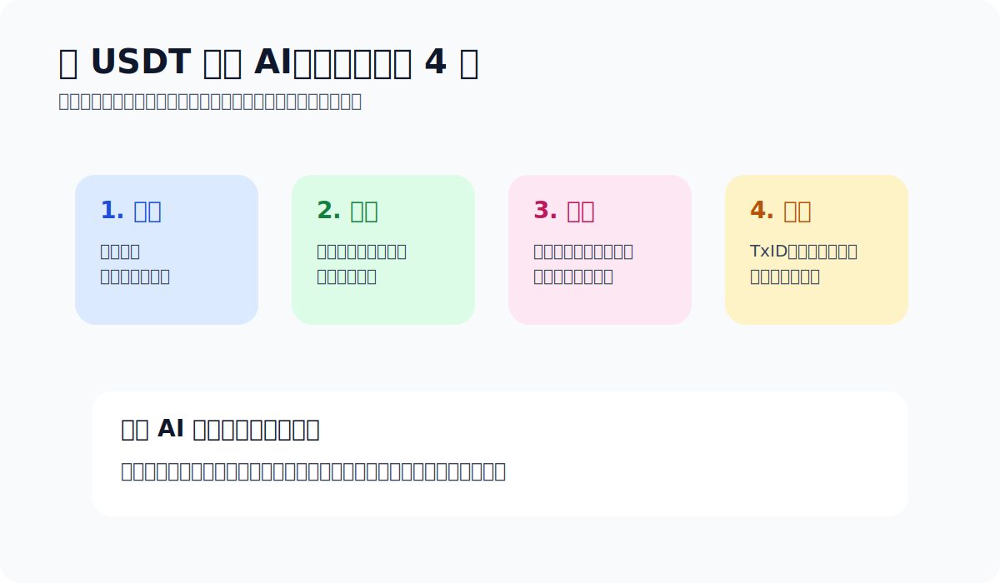

# 如何用 USDT 订阅 AI

> Chapter 4 · Use Cases · Last updated: 2026-04-14

很多人买 USDT 不是为了交易，而是为了把 AI 工具、海外服务或数字订阅续上。这类场景其实比“怎么买币”更能检验你是不是真的会用钱包。这篇讲的不是“能不能”，而是**通常怎么走、开始前要准备什么、哪里最容易踩坑。**

> TL;DR：常见路径分两类。一类是服务商直接支持加密支付；另一类是先用 USDT 给某个支付服务或虚拟卡充值，再去订阅目标 AI 产品。两类路径的共同点：先确认支持的币和链、先小额测试、支付钱包和储蓄钱包分开。别把“能付”误会成“可以随便付”。

## 先看你面对的是哪条路径

### 路径 A：商家直接支持加密支付
最短路径。确认对方支持的网络、币种、金额规则和支付时效，然后付款。听起来简单，但越是这种“看起来最短”的路径，越容易让人少看一行规则。

### 路径 B：USDT → 中间支付 / 虚拟卡 → AI 订阅
现实里更常见。兼容性高，但步骤多。好处是能覆盖那些暂不直接支持加密支付的产品；坏处是环节多了，出错点也跟着多。

## 开始前建议先准备这 4 件事

- **准备自己的钱包**：后面所有充值、收款、付款、核对都要靠它。
- **确认网络**：比如对方收的是 TRC20 还是其他链。
- **把支付钱包和储蓄钱包分开**：拿来付款的地址和长期存钱的地址，最好别混用。
- **保留凭证**：TxID、订单号、截图都留着，出问题时比情绪有用。

## 官方参考

- [imToken TRX 钱包支持专题](https://support.token.im/hc/zh-cn/sections/360006457153-TRX-%E9%92%B1%E5%8C%85)
- [imToken：如何获得带宽与能量](https://support.token.im/hc/zh-cn/articles/360037636294-%E5%A6%82%E4%BD%95%E8%8E%B7%E5%BE%97%E5%B8%A6%E5%AE%BD%E4%B8%8E%E8%83%BD%E9%87%8F)
- [imToken：转账时提示“对方地址未激活”](https://support.token.im/hc/zh-cn/articles/4513324315929-%E8%BD%AC%E8%B4%A6%E6%97%B6%E6%8F%90%E7%A4%BA-%E5%AF%B9%E6%96%B9%E5%9C%B0%E5%9D%80%E6%9C%AA%E6%BF%80%E6%B4%BB)

如果你准备长期用 TRON / USDT 付海外服务，这几份资料适合和这篇一起看。

## 真正容易出错的地方

- **付到错误网络**：这类错误最伤，对方未必能帮你处理。
- **第一次直接大额**：面对新商家、新工具、新路径，先小额测试。
- **拿主钱包到处授权**：一旦权限被滥用，损失可能远大于订阅费。
- **不留付款记录**：没有 TxID，对账就只能各说各话。

> 支付前的默认工具：想要一个相对好上手的自托管钱包来做 TRON / USDT 支付，我一般让人先从 imToken 开始。理由很朴素：先把钱包、地址、收款、资源和转账这几件最基础的事跑稳，比到处试新工具更重要。

## 给新手的默认建议

1. 先把钱包准备好，别等要付款时才临时找工具。
2. 第一次只测一笔小额。
3. 任何需要频繁授权的网站，都别直接用长期存钱的钱包。
4. 走 TRON 路线的话，还要考虑资源和手续费。

> 风险提醒：AI 工具、VPN、eSIM、海外服务的可用性和支付规则，会因国家、地区、服务条款和商家政策不同而变化。请在操作前自行确认当地法律、服务条款和支付支持情况。任何索要助记词或私钥的“客服”都应视为高风险。

## 一句更现实的结论

AI 订阅看起来像支付问题，实际上还是钱包和流程问题。把钱包分层、确认网络、留好记录这三件事做稳，成功率比到处找“神奇捷径”高得多。有用的从来不是什么神秘渠道，而是这些基础动作你做没做对。

## 上一篇 / 下一篇

- 上一篇：[TRON 能量指南](./tron-energy-guide.md)
- 下一篇：[USDT 可以拿来做什么](./what-can-you-do-with-usdt.md)
