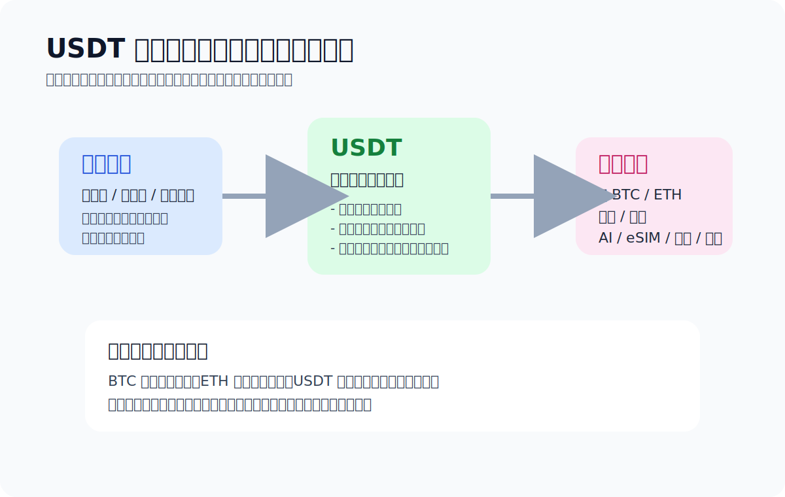

# USDT 是什么？

> Chapter 0 · Basics

USDT 本质上是稳定币。我更喜欢用一句人话讲清楚：**价格目标接近美元的链上记账单位**。它不像 BTC 那样拿来拼波动，更多是用来把买币、转账、支付和链上操作这些动作先跑顺。

> TL;DR：很多新手接触加密资产的第一步，不是直接买 BTC，是先拿到 USDT。原因很现实：在大量交易、支付和链上场景里，USDT 更像“基础结算层”。你可以不喜欢这个名字，但大概率绕不开。

> 延伸：如果你现在卡在“USDT 和 USDC 到底差在哪”，直接读 [USDT 和 USDC 有什么区别](./usdt-vs-usdc.md)。

## 我为什么总把 USDT 说成“中间层”

因为从新手路径看，USDT 最像一条通道，不是终点。

你真正会遇到的通常是这几类问题：

- 想买 BTC / ETH，第一步先经过 USDT
- 想把钱从平台提到钱包
- 想做一笔链上转账
- 想给 AI、eSIM、VPN、海外服务付款

这些动作里，USDT 不是最酷的资产，但经常是**最先用到的工具**。

## USDT 和 BTC / ETH 到底差在哪

**USDT 和 BTC / ETH 的核心差别**在于角色：BTC 更像资产本体（定位"数字黄金"、靠供给稀缺维持价值），ETH 更像智能合约生态的燃料（支付链上计算费用），USDT 更像结算中间层（价格稳定，拿来交易、转账、支付）。

我更喜欢这样分：

| 资产 | 我自己的理解 | 新手最常在哪一步碰到 |
| --- | --- | --- |
| BTC | 更像资产本体 | 真正开始配置或长期持有时 |
| ETH | 更像生态燃料 | 进以太坊生态、交互合约时 |
| USDT | 更像中间结算层 | 买入、转账、支付、链上过渡时 |

这个分法不学术，但对新手有用，因为它直接决定你后面会怎么用它们。

## 为什么很多人第一步先碰到 USDT

**新手第一步常常是 USDT 而不是 BTC**：不是因为 USDT "更高级"，而是大多数币种的交易对以 USDT 计价、转账和支付用稳定币比波动资产更容易理解、新手也倾向先用一个价格稳定的单位把流程跑顺。

不是因为 USDT 比 BTC 更“高级”，是因为在实际工作流里它更常被拿来当中间层。很多人嘴上说想买 BTC，真正动手时，第一步碰到的是 USDT。

- 很多币种都直接和 USDT 交易对。
- 转账、收款、支付时，稳定币更容易理解。
- 比起一上来就扛大波动，新手先用一个相对稳定的单位熟悉流程会轻松得多。

## 新手最容易误会的地方

- 以为 USDT 只有一种，不分网络。
- 以为买到 USDT 就等于会用。
- 以为稳定币就没有操作风险。实际的风险常常在链、地址、平台和支付路径上。

## 我会怎么给新手下一个最短结论

如果你只想先记一句话，记这个：

**USDT 更像一层稳定的过渡通道，不是所有问题的答案。**

把它看成工具，很多事会更清楚；
把它误会成“买完就结束”，后面往往会翻车。

> 风险提醒：稳定币的“稳定”说的是价格目标，不代表操作绝对安全。网络选错、地址填错、平台规则没看懂，照样会出问题。

## 上一篇 / 下一篇

- 上一篇：[Start Here](./start-here.md)
- 下一篇：[如何购买 Tether USDt（USDT）](./how-to-buy-usdt.md)
- 延伸：[USDT 和 USDC 有什么区别](./usdt-vs-usdc.md)
